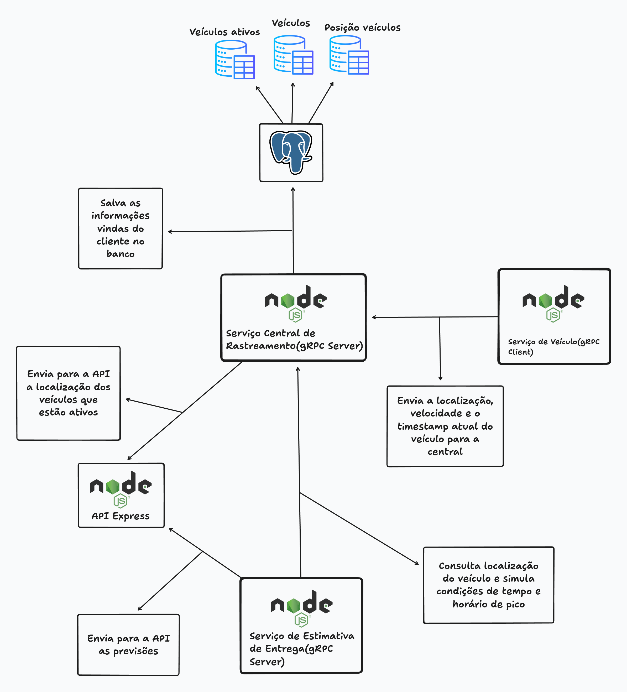
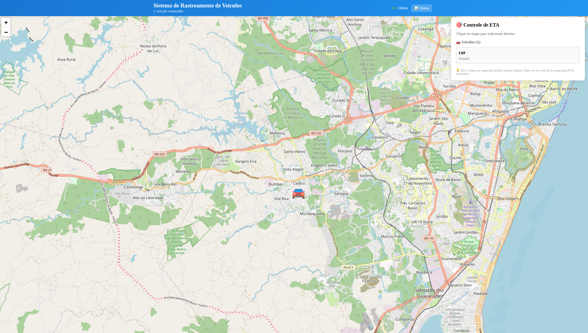

# Sistema de Rastreamento Veicular com gRPC, PostgreSQL e React

Este projeto é uma demonstração de um sistema de rastreamento veicular em tempo real utilizando **gRPC**, **PostgreSQL**, **React** e **Leaflet**, com capacidade de calcular rotas, estimar tempos de chegada e visualizar veículos em movimento.

A arquitetura foi projetada para garantir **comunicação eficiente entre serviços**, **persistência de dados** e **atualizações em tempo real** através de WebSockets.

Este projeto foi desenvolvido como parte da disciplina de Sistemas Distribuídos por:

- [github.com/tuliobaruk](https://github.com/tuliobaruk)
- [github.com/thiagojorgelins](https://github.com/thiagojorgelins)

---

## Tecnologias Utilizadas

[](#)
[](#)
[](#)
[](#)
[](#)
[](#)
[](#)
[](#)
[](#)
[](#)

---

## Diagrama de Arquitetura

[](./docs/Diagrama-gRPC.png)

---

## Decisões Arquiteturais e Benefícios do gRPC

A arquitetura deste sistema foi projetada para oferecer comunicação eficiente, confiabilidade e visualização em tempo real do rastreamento veicular.

O **gRPC** foi escolhido como o protocolo de comunicação entre os serviços por suas vantagens significativas sobre REST tradicional:

- **Desempenho superior**: Comunicação baseada em Protocol Buffers é mais eficiente em termos de processamento e banda do que JSON/XML
- **Contrato bem definido**: A interface é especificada através de arquivos `.proto`, garantindo consistência entre os serviços
- **Suporte a streaming bidirecional**: Ideal para atualizações contínuas de posição em tempo real
- **Geração automática de código**: Reduz erros e aumenta a produtividade de desenvolvimento

Os serviços foram separados em componentes distintos com responsabilidades bem definidas:

- **Central Tracking Service**: Núcleo do sistema que gerencia veículos e suas posições utilizando Prisma ORM para persistência em PostgreSQL
- **ETA Service**: Calcula estimativas de tempo de chegada baseadas em velocidade atual, tráfego e condições climáticas
- **Express gRPC Gateway**: Fornece uma interface REST/WebSocket para o frontend, traduzindo requisições HTTP para chamadas gRPC
- **Vehicle Client**: Simula veículos enviando dados de GPS em intervalos configuráveis
- **Frontend React**: Interface web com mapa interativo mostrando posições em tempo real

Esta arquitetura distribuída proporciona:
- **Escalabilidade**: Cada componente pode ser escalado independentemente
- **Resiliência**: Falhas em um serviço não comprometem o sistema inteiro
- **Manutenibilidade**: Componentes podem ser atualizados separadamente
- **Testabilidade**: Serviços isolados são mais fáceis de testar

---

## Pré-requisitos

- **Docker**
- **Docker Compose**

---

## Estrutura do Projeto

```
.
├── central-tracking-service/  # Serviço central de rastreamento (gRPC + Prisma)
├── eta-service/              # Serviço de cálculo de tempo estimado de chegada
├── express-grpc-gateway/     # API Gateway REST/WebSocket para o frontend
├── protos/                   # Definições Protocol Buffers para interfaces gRPC
├── vehicle-grpc-client/      # Cliente para simular veículos enviando coordenadas
├── vehicle-tracking-frontend/ # Interface web React com mapa Leaflet
├── docker-compose.yml        # Configuração para orquestração dos serviços
├── vehicle-tracker.sh        # Script de gerenciamento do sistema
└── README.md
```

---
# Rodando o projeto

## Método 1: Script de Gerenciamento Interativo

Utilizando o script `vehicle-tracker.sh`, você pode gerenciar todo o sistema de forma interativa:

```bash
chmod +x vehicle-tracker.sh
./vehicle-tracker.sh
```

Este script oferece as seguintes funcionalidades:
- Iniciar/parar a infraestrutura
- Verificar status dos serviços
- Iniciar veículos com diferentes configurações
- Verificar veículos em execução
- Acessar o cliente ETA interativo
- Diagnosticar problemas
- Limpar dados


## Método 2: Docker Compose

Alternativamente, você pode iniciar os serviços manualmente com Docker Compose:

```bash
docker-compose up -d
```

Para adicionar veículos manualmente:

```bash
docker-compose exec vehicle-client node dist/client.js \
  --file GPX/CampusJBG-Recife.gpx \
  --id carro-01 \
  --server central-tracking-service:50051 \
  --interval 5 \
  --vel 60
```

---

## Funcionamento

### 1. Utilizando o frontend

O projeto inclui uma interface web React com um mapa interativo mostrando a localização dos veículos em tempo real.

Basta acessar:

```bash
http://localhost:5173
```



### 2. Consultando posição de veículos via API REST

Endpoint:

```
GET http://localhost:3001/api/vehicles
```

Resposta com dois veículos rodando:

```json
{
  "success": true,
  "data": [
    {
      "vehicleId": "car",
      "lat": -8.137748,
      "lon": -35.003638,
      "vel": 50,
      "timestamp": "1747982592998",
      "lastUpdate": 1747982592999
    },
    {
      "vehicleId": "car-2",
      "lat": -8.114405,
      "lon": -35.031182,
      "vel": 100,
      "timestamp": "1747982594999",
      "lastUpdate": 1747982595000
    }
  ],
  "count": 2
}
```

### 3. Calculando ETA para um destino

Endpoint:

```
POST http://localhost:3001/api/eta
```

Payload:

```json
{
  "vehicleId": "car",
  "destinationLat": -8.0476,
  "destinationLon": -34.8770
}
```

Resposta:

```json
{
  "success": true,
  "data": {
    "vehicleId": "car",
    "currentLat": -8.145136,
    "currentLon": -35.0001,
    "destinationLat": -8.0476,
    "destinationLon": -34.877,
    "distanceKm": 17.36,
    "currentSpeed": 50,
    "estimatedMinutes": 21,
    "arrivalTime": "2025-05-23T07:05:29.941Z",
    "trafficCondition": "Trânsito livre",
    "weatherCondition": "Tempo bom",
    "confidence": 0,
    "calculatedAt": "2025-05-23T06:44:29.953Z"
  }
}
```

## Fluxo mais detalhado do processamento

1. **Vehicle Client** carrega rotas pré-definidas de arquivos GPX e envia coordenadas sequencialmente via gRPC para o **Central Tracking Service**
   - Os arquivos GPX contêm waypoints de rotas reais pré-gravadas (ex: Campus JBG → Recife)
   - O cliente simula o movimento do veículo seguindo esses waypoints em intervalos configuráveis
   - Velocidade e intervalo entre pontos podem ser ajustados para simular diferentes condições

2. **Central Tracking Service** recebe as coordenadas e:
   - Armazena as posições no PostgreSQL via Prisma ORM
   - Mantém o estado atual de todos os veículos ativos
   - Responde aos clientes com confirmação de rastreamento

3. **ETA Service** consulta o Central Tracking Service para:
   - Obter posições atuais dos veículos
   - Calcular distâncias até o destino usando a fórmula de Haversine
   - Considerar fatores como velocidade atual, condições de tráfego e clima
   - Gerar estimativas precisas de tempo de chegada (ETA)

4. **Express gRPC Gateway** atua como intermediário:
   - Traduz requisições REST para chamadas gRPC
   - Estabelece conexões WebSocket com o frontend para atualizações em tempo real
   - Consulta periodicamente o Central Tracking Service para obter posições atualizadas
   - Transmite dados de posição para todos os clientes conectados via WebSocket

5. **Frontend React** visualiza os dados:
   - Renderiza o mapa interativo usando Leaflet
   - Consome eventos WebSocket para atualizações em tempo real
   - Exibe marcadores de veículos nas posições corretas
   - Atualiza a interface sem necessidade de recarregar a página

---

## Como implementamos a comunicação entre serviços utilizando gRPC

Os serviços se comunicam através de interfaces definidas em arquivos Protocol Buffers (`.proto`):

```protobuf
// Exemplo de definição do serviço de rastreamento
service Tracker {
  // Streaming bidirecional para rastreamento em tempo real
  rpc StreamLocation(stream VehicleUpdate) returns (stream VehicleUpdate);

  // Endpoints unários para consulta de status (usado pelo serviço ETA)
  rpc GetVehicleStatus(VehicleStatusRequest) returns (VehicleStatusResponse);
  rpc ListVehicles(ListVehiclesRequest) returns (ListVehiclesResponse);
}
```

O serviço central utiliza **streaming bidirecional** para receber atualizações de localização, permitindo comunicação em tempo real:

```typescript
function streamLocation(call: grpc.ServerDuplexStream<any, any>) {
  call.on("data", async (update) => {
    // Processa a atualização de localização
    await saveVehiclePosition(
      update.vehicleId,
      update.lat,
      update.lon,
      update.vel,
      update.timestamp
    );
    
    // Envia resposta de volta para o cliente
    call.write({
      vehicleId: update.vehicleId,
      status: "TRACKING_ACTIVE",
      timestamp: Date.now()
    });
  });
}
```

O **Express gRPC Gateway** traduz requisições HTTP e WebSocket para chamadas gRPC:

```javascript
// Monitora veículos e transmite via WebSocket
function monitorVehicles() {
  setInterval(() => {
    trackingClient.ListVehicles({}, (error, response) => {
      // Processa resposta e transmite para clientes WebSocket
      const vehicles = response.vehicles || [];
      broadcastVehiclePositions(vehicles);
    });
  }, 2000);
}
```

Esta arquitetura baseada em gRPC proporciona:
- **Alta eficiência** na transmissão de dados
- **Baixa latência** para atualizações em tempo real
- **Contratos claros** entre serviços
- **Extensibilidade** para adicionar novos serviços

---

## Contribuição e Melhorias Futuras

Contribuições são bem-vindas! Áreas para melhoria:

- Implementação de autenticação e autorização
- Suporte a clusters para alta disponibilidade
- Armazenamento de histórico em banco de dados de séries temporais
- Algoritmos mais sofisticados para estimativa de tempo de chegada
- Integração com serviços de clima e trânsito reais